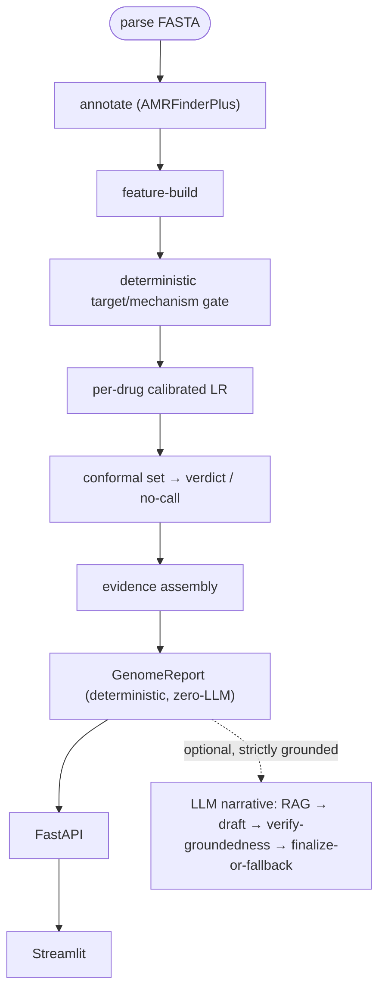

# Genome Firewall — Implementation Plan / PRD

> Repo: **ResistanceRecon** (https://github.com/cofade/ResistanceRecon) · Python package: `genome_firewall` · Product: **Genome Firewall**
> Hack-Nation 6th Global AI Hackathon · Challenge 06 · 2026-07-18 · Authors: Sebastian Wienhold + Claude (Fable 5)
> *This plan file becomes `prd.md` in the repo as the first execution commit.*

---

## Context

**Problem.** Antibiotic-resistant infections kill >1M people/year directly. Standard lab susceptibility testing takes 1–3 days; during that window clinicians must guess, and every ineffective treatment costs the patient time and breeds more resistance. Much of the answer is already written in the pathogen's DNA.

**What we build.** *Genome Firewall* — a trustworthy, strictly **defensive** decision-support prototype that turns a reconstructed, quality-checked bacterial genome (FASTA) for **Klebsiella pneumoniae** into a per-antibiotic verdict: **LIKELY TO WORK / LIKELY TO FAIL / NO-CALL**, each with a *calibrated* confidence score and the *supporting genes/mutations*. It honestly separates a known resistance mechanism from a mere statistical association, abstains when evidence is weak/conflicting/novel, and insists every result be confirmed by standard lab testing. It never designs, modifies, or suggests changes to an organism.

**Why this shape.** The challenge rewards depth over breadth, calibrated honesty over headline accuracy, and defensive framing. It also embodies the north star of Sebastian's *Sustainable Agentic Software Engineering* paper — **Ground Truth First: never a claim without traceable evidence** — the same discipline as the challenge's "honest explanations" requirement. So we build this as a live case study of the six-layer framework, capturing fresh paper ground-truth as we go.

**Outcome.** A deployed Streamlit+FastAPI demo over a rigorous, reproducible classical-ML pipeline with an evidence-grounded report, on foundations that extend cleanly to MRSA.

---

## Locked decisions

| Decision | Choice |
|---|---|
| **Species** | *Klebsiella pneumoniae* (taxon 573) first; *S. aureus*/MRSA documented follow-up |
| **Antibiotic panel** | meropenem, ceftriaxone, ciprofloxacin, gentamicin, trimethoprim-sulfamethoxazole (ampicillin = fixed intrinsic-resistance flag, excluded from ML; colistin = stretch) |
| **Data** | Self-source from BV-BRC; lab-measured AST only (`evidence == 'Laboratory Method'`) |
| **Annotation** | AMRFinderPlus via pinned Docker image under WSL2; BV-BRC `.spgene` calls as sanity-check only (leakage risk) |
| **Modeling** | Classical ML is the star: per-antibiotic L2 logistic regression, `class_weight='balanced'` |
| **Confidence / no-call** | Sigmoid calibration (`CalibratedClassifierCV`, `cv='prefit'`) + conformal prediction (crepes Mondrian primary, MAPIE cross-check) |
| **Split** | Homology-aware grouped split: MLST ST primary, Mash single-linkage @ ANI 99.5% fallback; `StratifiedGroupKFold` + leave-one-group-out unseen-lineage holdout |
| **LLM role** | Surgical & structurally barred from prediction: (1) evidence RAG, (2) grounded NL report, (3) LLM-as-reviewer. OpenAI primary, `MockLLMClient` in CI. Image gen/analysis parked |
| **Demo** | Streamlit front + FastAPI backend; deployed to **Streamlit Community Cloud** |
| **Compute** | AMRFinderPlus in Docker/WSL2; demo pure-Python; **no bio-tools in CI** (MockAnnotator + fixture TSVs) |
| **Engineering** | Full six-layer Sustainable Agentic SE framework as a live case study |
| **License** | Apache-2.0 + `DISCLAIMER` (research prototype, not for clinical use) |
| **PM** | GitHub Issues (epics + sub-tasks) + Project board + one 24h-sprint milestone |
| **Time** | 24h sprint, depth-first, foundations built for extension — no quality sacrificed for speed |

---

## Architecture — `src/genome_firewall/` package

Core prediction path is a **plain deterministic Python function chain**; LangGraph is used **only** in the narrative sub-pipeline. The `llm/` package is import-isolated — a CI check fails the build if `reader/`, `features/`, or `predictor/` import from `llm/`.

**Module 01 — Genome Reader** (`reader/`): `fasta_parser.py`, `amrfinder_runner.py` (Docker/WSL2, `ok/source/error` envelope), `feature_builder.py` (two tables: gene presence/absence from `Element subtype==AMR`; point-mutations from `POINT/POINT_DISRUPT`; `Method` kept as auxiliary confidence; `PARTIAL_CONTIG_END` flagged; emits versioned `feature_schema.json`), `spgene_crosscheck.py` (sanity only).

**Module 02 — The Predictor** (`predictor/`) — *the star, LLM-free*: `dataset.py` (BV-BRC label ingestion, `evidence=='Laboratory Method'` filter, SIR normalization), `split.py` (homology-aware grouped split), `target_gate.py` (deterministic rule table from AMRFinderPlus resistance-hierarchy metadata — a known carbapenemase ⇒ `likely_to_fail` for carbapenems, `evidence_category=known_mechanism`, precedes the model), `train.py` (L2 LR + inner grouped-CV `C`), `calibration.py` (sigmoid, `cv='prefit'` on grouped calib fold), `conformal.py` (split/Mondrian conformal → sets: `{S}`→work, `{R}`→fail, `{S,R}`→no-call ambiguous, `{}`→no-call novel/OOD), `predict.py` (composes gate→model→conformal), `model_registry.py` (versioned artifacts + `feature_schema.json` compat check raising a typed error on mismatch).

**Module 03 — Decision Report** (`report/`, `api/`, `ui/`): deterministic `report_builder.py` + `evidence.py` (assembles `GenomeReport` with hardcoded disclaimer, zero LLM — the MVP core AND demo fallback); additive LangGraph `narrative_pipeline.py` (RAG→narrate→verify-grounding→finalize-or-template). **FastAPI**: `POST /predict`, `GET /health` (WSL2/Docker + model-registry reachability), `GET /antibiotics`, `GET /model-card`. **Streamlit**: upload → firewall rule table (ALLOW/BLOCK/REVIEW = work/fail/no-call, green/red/amber) → evidence drill-down (known-mechanism vs statistical-association badges) → calibration/reliability page; **non-dismissible "confirm with standard lab testing" banner on every view**.

**Pydantic schemas** (`schemas.py`, adapted from `agentic-ai-challenge/schemas.py`, `extra='forbid'`, closed `Literal` enums, cross-field validators): `GenomeInput, ContigRecord, AmrFeature, GenomeFeatureVector, GateResult, ModelPrediction, ConformalSet, EvidenceItem, AntibioticPrediction, GenomeReport, GenomeFirewallState`. **No raw dicts cross a module boundary.** LLM output schemas contain **no** verdict/confidence field — the boundary is structural, not prompt-based.

**Artifacts:** `data/raw/bvbrc/`, `data/interim/amrfinder_calls/`, `data/processed/{feature_matrix.parquet,labels.parquet,splits/}`, `models/<drug>/v<N>/{model.joblib,calibrator.joblib,conformal.json,feature_schema.json,metrics.json,model_card.md}`.

---

## The three surgical LLM uses (structurally barred from prediction)

1. **Evidence RAG** (`kb/` — hybrid BM25+embedding+RRF from `agentic-ai-challenge/kb/`): retrieves cited AMR-mechanism KB chunks (CARD ARO, AMRFinderPlus reference notes, review summaries) for *already-detected* genes. Retrieval-only — the `known_mechanism` vs `statistical_association` tag is set by **deterministic KB-membership**, never by the LLM.
2. **Grounded NL report** (`report/agents/narrate.py`): turns the frozen `GenomeReport` into clinician prose, temp 0, structured output, references only values already in the report.
3. **LLM-as-Reviewer** (`report/agents/verify_grounding.py`): a deterministic substring/number pre-check runs first, then an LLM judge; `overall_pass=false` **fails closed** to the deterministic template report with `review_status='llm_output_rejected'`.

OpenAI is the primary backend (structured outputs); `MockLLMClient` makes all LLM code deterministically testable and API-key-free in CI; Anthropic kept swappable.

---

## Responsibility requirements → concrete implementation

| Requirement | How it's satisfied |
|---|---|
| **Defensive by construction** | No sequence-writing/design capability exists anywhere; enforced by absence + bandit/grep pre-commit + ADR-0006 stated as golden rule |
| **Honest generalization** | `MODEL_CARD.md` + UI report per-antibiotic performance on the grouped split incl. **held-out unseen genetic groups**; explicit "covered / not covered" species+drug list; machine-readable coverage manifest on every API response |
| **Calibrated confidence + no-call** | Calibrated (not raw) probabilities; reliability diagram + Brier on held-out split; conformal NO-CALL is a first-class verdict distinct from low-confidence, rendered with distinct styling |
| **Honest explanations** | `evidence_category` field separates deterministic known-mechanism from SHAP/statistical association (labeled "association, not proven cause"); reviewer flags any causal language on a statistical item |
| **Human oversight** | Canonical disclaimer enforced at **three** independent points: Pydantic validator, reviewer substring check, non-dismissible UI banner |

---

## Sustainable Agentic SE scaffolding (six layers)

- **L1 Context:** `CLAUDE.md` (golden rule: *“the LLM never predicts — the deterministic LR+calibration+conformal gate is the sole source of work/fail/no-call; LLM output is never a model input”*), `AGENTS.md`, `.claude/agents/senior-reviewer.md`.
- **L2 Quality Gates:** `pyproject.toml` (uv; ruff, mypy `--strict`, bandit high, pytest cov `fail_under=80`; deps `pydantic, biopython, pandas, scikit-learn, crepes/mapie, fastapi, uvicorn, streamlit` + optional groups `[ml][llm][tracking][dev]`; AMRFinderPlus is a Docker subprocess, never an import), `.pre-commit-config.yaml`.
- **L3 Docs-as-Code:** root folder **`Documentation/`** (Sebastian's convention). arc42-lite chapters `Documentation/01-introduction-and-goals.md, 02-constraints.md, 05-building-block-view.md, 06-runtime-view.md, 08-crosscutting-concepts.md, 11-risks-and-technical-debt.md`, + `Documentation/roadmap.md`, `Documentation/12-glossary.md`, `Documentation/MODEL_CARD.md`, `Documentation/DATASHEET.md`, ADRs `Documentation/09-architecture-decisions/ADR-0001..0008.md`, plus **`Documentation/research-findings/`** subfolder persisting the full workflow research (see EPIC 0).
- **L4 CI/CD:** `ci.yml` (3 parallel jobs lint/test/security; **no Docker/bio-tools** — MockAnnotator + committed fixture TSVs drive the full pipeline; **import-boundary test** asserts `predictor/` imports nothing from `llm/`), `release.yml` (PR-label semver, enabled after MVP).
- **L5 Human-Agent Workflow:** plan-first, feature branch per issue, human approval gate, conventional commits, `/clear` between features.
- **L6 Entropy Management:** `ground-truth/{README.md,decisions.jsonl,session-log-template.md}` (append-only decision log = the paper's data source), Known-AI-Pitfalls log in CLAUDE.md, ADRs, golden principles. Coverage drops in `predictor/`/`reader/` require an ADR.

**Reuse map:** `agentic-ai-challenge/` (schemas, llm abstraction+MockLLMClient, kb retrieval, confidence pattern, eval harness, CI, ADRs) · `agentic-software-engineering/templates/` (CLAUDE.md, pyproject, pre-commit, ci.yml, release.yml) · `open-garden-planner/` (release automation, conftest isolation) · `EPOChallenge/` (ok/source/error envelope, `validate` smoke-test) · `PatentSchmiede/backend/` (async FastAPI lifespan/CORS/config) · `digitalsreeni-image-annotator/.../mlflow_tracker.py` (tracking).

---

## Build order → GitHub issues (epics + tasks under one milestone “24h Sprint — Genome Firewall MVP”)

**EPIC 0 — Scaffolding, documentation & SE foundation** (L1/L2/L3/L4/L6) — *documentation FIRST, before any code*:
- **0.1 Persist the research (do this first).** Create `Documentation/` and `Documentation/research-findings/`; write the full R1–R4 + D1–D3 workflow output as reviewable arc42-adjacent `.md` — one file per agent (`bv-brc-data-access.md`, `amrfinderplus-features.md`, `ml-methodology.md`, `antibiotic-panel.md`, `architecture.md`, `se-scaffolding.md`, `llm-boundary.md`), each with its key findings, specific choices, commands, **and the source URLs**. Source: the workflow journal `…/wf_8772eb55-01b/journal.jsonl` (already on disk) is the ground truth to transcribe from.
- **0.2 Reuse inventory.** `Documentation/reuse-inventory.md` (the doc the Haiku explorers' findings were meant to become — which projects/files we copy/adapt).
- **0.3 arc42-lite skeleton + 8 ADRs** seeded under `Documentation/` (see L3), decisions captured while fresh.
- **0.4 Repo skeleton:** `pyproject.toml`, `CLAUDE.md`, `AGENTS.md`, `.pre-commit-config.yaml`, Apache-2.0 `LICENSE`, `DISCLAIMER`, `prd.md` (this plan).
- **0.5** `ci.yml` green against empty `src/` + `conftest.py`; `ground-truth/` logging started.
- **Golden rule going forward:** every subsequent research/design result is written into `Documentation/` in the same session it's produced — no findings live only in chat.

**EPIC 1 — Data pipeline** (Module 01 data): `scripts/fetch_bvbrc_data.py` (FTPS `RELEASE_NOTES/PATRIC_genome_AMR.txt` + Data API cross-check; **enumerate all distinct `evidence` values** before finalizing filter; download `.fna` only for label-bearing genome_ids); `scripts/build_dataset.py`; capture `testing_standard` (CLSI/EUCAST) as metadata. Verify FTPS reachability + exact filename from a real client early.

**EPIC 2 — Genome Reader** (Module 01): `schemas.py`; `reader/` (parser, pinned-Docker AMRFinderPlus runner `-O Klebsiella_pneumoniae --plus --name`, feature builder, `feature_schema.json`); `MockAnnotator` + fixture TSVs for CI; pull `ReferenceGeneCatalog.txt` (pinned) for gene→Class/Subclass.

**EPIC 3 — Predictor** (Module 02, *the star*): `dataset.py`, `split.py` (MLST + Mash fallback, min-n gate ≥20 R/≥20 S else insufficient-data no-call), `target_gate.py`, `train.py`, `calibration.py`, `conformal.py`, `predict.py`, `model_registry.py`; per-drug feature engineering (QRDR mutation counts for cipro; RMTase-dominant + drug-specific AME map for gentamicin); MLflow tracking.

**EPIC 4 — Decision Report core** (Module 03a): `report/evidence.py` + `report_builder.py` (deterministic `GenomeReport` + hardcoded disclaimer) — **first LLM-free MVP**.

**EPIC 5 — Evidence RAG + LLM narrative + reviewer**: seed AMR-mechanism KB; `kb/` retrieval; `llm/` client+factory+MockLLMClient+OpenAI backend; `report/agents/{retrieve,narrate,verify_grounding}.py` + narrative pipeline (fail-closed to template).

**EPIC 6 — API + UI** (Module 03b): FastAPI (`predict/health/antibiotics/model-card`, 503 envelopes); Streamlit (upload → firewall table → evidence drill-down → calibration; persistent disclaimer banner).

**EPIC 7 — Evaluation & honesty artifacts**: `eval/runner.py` (per-drug balanced-accuracy, **resistant-recall headline**, susceptible-recall, F1, AUROC, PR-AUC, Brier, reliability, no-call-rate + accuracy-on-called; marginal + per-group + unseen-lineage); write `MODEL_CARD.md` + `DATASHEET.md` against real numbers; own genotype→phenotype concordance check.

**EPIC 8 — Docs & ground-truth**: finalize `Documentation/` arc42-lite + ADRs; keep `Documentation/research-findings/` and `ground-truth/decisions.jsonl` current as the build evolves.

**EPIC 9 — Submission**: `scripts/validate_environment.py` smoke test; deploy to Streamlit Community Cloud (OpenAI key via secrets); publish processed dataset + download script (release asset); Project Summary (150–300 words); Demo/Tech/Team videos; `git archive` zip; submit to projects.hack-nation.ai.

---

## Verification (end-to-end)

1. **Environment:** `scripts/validate_environment.py` returns PASS for WSL2/Docker + pinned AMRFinderPlus DB version + BV-BRC reachability + model artifacts loadable.
2. **Data integrity:** distinct `evidence` values logged; label counts + R/S/I balance per drug reported; grouped split verified to place no genome_id on both sides (explicit test).
3. **Pipeline:** `POST /predict` on a held-out fixture FASTA returns a `GenomeReport` with per-drug verdict + calibrated confidence + evidence_category + disclaimer; a deliberately OOD genome triggers NO-CALL.
4. **Metrics:** `eval/runner.py` produces the full metric set incl. the unseen-lineage holdout; reliability diagram + Brier rendered in the model-card page.
5. **LLM boundary:** CI import-boundary test passes; MockLLMClient tests cover narrate happy-path and reviewer reject→template fallback; schema test asserts no LLM-writable field can carry a verdict/confidence.
6. **Demo rehearsal:** run the **deterministic (no-API-key) path** as a first-class demo path so an OpenAI outage never looks broken; confirm disclaimer banner on every page.
7. **Quality gates:** `ruff`, `mypy --strict`, `bandit`, `pytest` (cov ≥80) all green locally and in CI.

---

## Key risks & to-validate (carry into execution)

- **BV-BRC access:** confirm FTPS reachability + exact filename (`PATRIC_genome_AMR.txt` variants) from a real `lftp`/`wget` client before wiring the Makefile; enumerate `evidence` vocabulary (docs say 4 values, API showed 2).
- **Label volume after grouped split:** ~4,976 K. pneumoniae genomes have lab AST; per-drug counts shrink after clustering — gate drugs below min-n to insufficient-data no-call rather than shipping an unstable model.
- **AMRFinderPlus:** pin tag ≥4.2.5 (4.2.4 had a `--organism Klebsiella_pneumoniae` DB bug); flag `PARTIAL_CONTIG_END` as QC, not real partial genes; no published K. pneumoniae AMRFinderPlus concordance study → run our own check, don't assume transfer.
- **Homology split correctness** is the single highest-value thing to get right — group by clonal lineage, not accession; test explicitly (clonal leakage inflates every metric).
- **Mock/real annotator drift:** fixture TSVs can diverge from the real tool — document a periodic manual re-validation against a real WSL2/Docker run.
- **LLM boundary shortcut** (feeding AMRFinderPlus/ML output straight into one LLM “reasoning” call) is the fastest-looking, most damaging crunch-time shortcut — called out in CLAUDE.md + enforced by the CID import test.
- **Demo SPOF:** AMRFinderPlus/WSL2/Docker — pre-compute a feature-vector cache for demo genomes + envelope-degrade to a clear banner.

---

## Documentation discipline (per Sebastian's mid-plan directive)

Everything the subagents produced is **persisted on disk** (workflow journal `…/wf_8772eb55-01b/journal.jsonl`) — nothing is lost. But findings-as-chat-prose is not documentation. The **first execution task (EPIC 0.1)** is to transcribe the full research/design into `Documentation/research-findings/` before any code, and the standing rule for the whole build is: *any research or design output gets written into `Documentation/` in the same session it's created.* Plan mode (read-only except this plan file) is the only reason it isn't already written; exiting plan mode unblocks it as step one.
