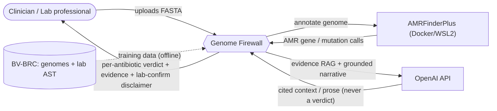

# 3. Context and Scope

## 3.1 Business context

Genome Firewall sits between a finished bacterial genome assembly and a clinician/lab decision. It starts **only after** isolation, sequencing, and genome reconstruction, and stops at decision support — it never treats a patient and never modifies an organism.

## 3.2 External interfaces

| Partner | Direction | Content | Notes |
|---|---|---|---|
| Clinician / lab user | in / out | FASTA in; verdict + evidence + disclaimer out | Human oversight is mandatory |
| BV-BRC | in (offline) | genomes + lab-measured AST labels | `evidence == 'Laboratory Method'` only |
| AMRFinderPlus (Docker/WSL2) | out / in | contigs → AMR gene/mutation calls | pinned image + DB version |
| OpenAI API | out / in | structured report context + prose | RAG + narration + review only; **never a verdict** |

## 3.3 Explicitly out of scope

Sample collection, DNA extraction, species identification, genome assembly/reconstruction, separating mixed samples, raw-MIC regression, and **any** organism design, modification, or synthesis.
