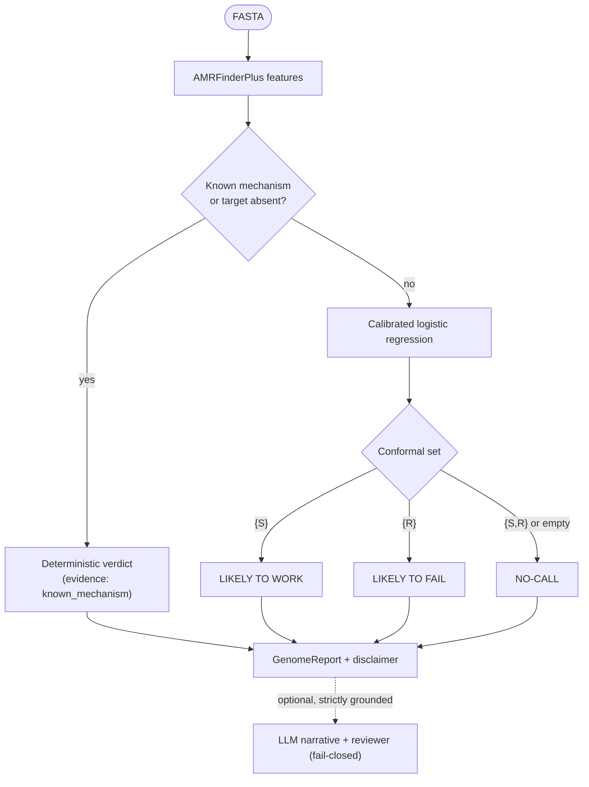

# 4. Solution Strategy

| Goal | Strategy |
|---|---|
| Trustworthy verdicts | Two layers: a **deterministic** known-mechanism / molecular-target gate, then a per-antibiotic **calibrated logistic regression**. |
| Honest uncertainty | **Conformal prediction** sets → first-class NO-CALL; calibrated probabilities with reliability + Brier. |
| Honest generalization | **Homology-aware grouped split** (MLST + Mash fallback) with an unseen-lineage holdout. |
| Evidence integrity | `evidence_category` separates a known mechanism from a mere statistical association. |
| Safe LLM use | LLM **structurally barred** from the prediction path (no verdict field; CI import gate). |
| Sustainable build | Six-layer Agentic SE framework; documentation before code. |

Related decisions: [ADR-0003](../09-architecture-decisions/ADR-0003-classical-ml-per-antibiotic-logistic-regression.md), [ADR-0004](../09-architecture-decisions/ADR-0004-calibration-and-conformal-prediction-for-no-call.md), [ADR-0005](../09-architecture-decisions/ADR-0005-homology-aware-grouped-split.md), [ADR-0006](../09-architecture-decisions/ADR-0006-llm-boundary-rag-reviewer-report-only.md).
