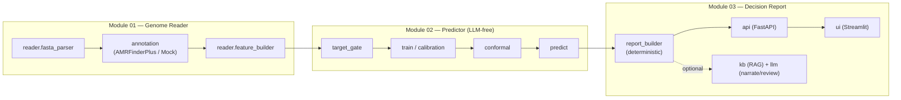

# 5. Building-Block View

## Level 0 — whitebox flow



## Level 1 — the package `genome_firewall`

```
reader/      Module 01 — FASTA parse (fasta_parser.py) + feature builder (feature_builder.py,
             ReferenceGeneCatalog lookup, feature_schema.json) -- the raw-annotation-to-vector step
annotation/  AMRFinderPlus Docker/WSL2 wrapper (envelope, amrfinder.py) + MockAnnotator (mock.py,
             fixtures, CI) -- the only place a subprocess/Docker call happens (golden rule #6)
features/    Module 02 feature engineering (EPIC 3): mechanisms.py (shared AMR-mechanism
             predicates), vocabulary.py (ordered feature vocabulary + engineered combination
             features -- QRDR counts, PMQR/RMTase/carbapenemase/ESBL flags), feature_matrix.py
             (GenomeFeatureVector -> fixed-order numeric rows). Trust-critical, LLM-free.
predictor/   Module 02 (the star) — dataset, subset, split, target_gate, train, calibration, conformal, predict, errors, model_registry, experiment_tracking (LLM-free; sole verdict source)
report/      Module 03a. Deterministic core: inputs.py (DrugPredictionInput/GenomePredictionInputs —
             the decoupled builder input, not in schemas.py), evidence.py (KNOWN/STATISTICAL/NO_SIGNAL
             tagging, ADR-0020), builder.py (build_report -> GenomeReport, zero-LLM), narrative.py
             (pure-Python deterministic render — no jinja2). Additive LLM narrative (receives the
             frozen report): nl_schemas.py (NLReportSection/ReportVerdict — no verdict field),
             narrator.py, reviewer.py (deterministic pre-check + LLM judge, fail-closed), pipeline.py
             (narrate_report -> NarrativeEnvelope). Narrator/reviewer live here, not a separate agents/.
kb/          AMR-mechanism KB (evidence RAG, retrieval-only): corpus.py (KBChunk + seed loader),
             seed/ (committed curated mechanism_chunks.jsonl), embedder.py (Embedder Protocol;
             HashingBagOfWordsEmbedder for CI, lazy SentenceTransformerEmbedder for prod),
             retriever.py (BM25 + optional dense, RRF fusion), evidence_rag.py, loader.py (offline
             catalog distiller). ADR-0019.
llm/         provider-agnostic client: types.py, errors.py, client.py (LLMClient Protocol +
             parse_structured_response), mock.py (MockLLMClient, CI), openai_backend.py (lazy,
             structured outputs), settings.py, factory.py. Report narration + reviewer only.
api/         Module 03b — FastAPI (POST /predict, GET /health, /antibiotics, /model-card)
ui/          Streamlit demo (firewall table, evidence drill-down, calibration, disclaimer banner)
eval/        metrics harness (marginal + per-group + unseen-lineage)
tracking/    error-tolerant MLflow wrapper
schemas.py   Pydantic contracts crossing every boundary
constants.py canonical disclaimer, supported species/antibiotics
```

Supporting: `scripts/` (BV-BRC fetch, AMRFinderPlus batch, dataset build, env validate, import-boundary check); `data/raw/`, `data/interim/`, `data/processed/`, and `models/` (git-ignored, published as release assets) -- but `data/reference/` (pinned lookup tables like `ReferenceGeneCatalog.txt`, ADR-0013) is committed, matching the fixture-data convention rather than the bulk-data one.

## Key responsibilities & boundaries

- **Only `predictor/` produces a verdict/confidence.** It imports nothing from `llm/`.
- **`annotation/` is the only place a subprocess/Docker call happens**, always returning `{ok, source, error, data}`.
- **`report/` builds a complete `GenomeReport` with zero LLM calls** (the MVP core + demo fallback); the LLM narrative is strictly additive and receives a frozen report.

Detail: [`research-findings/architecture.md`](research-findings/architecture.md).
