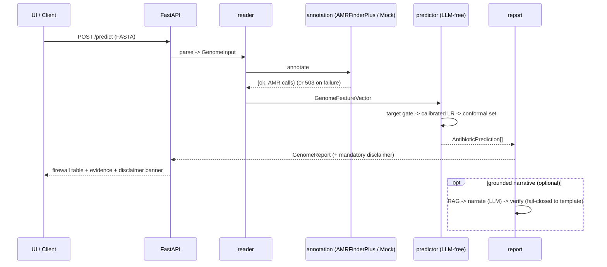
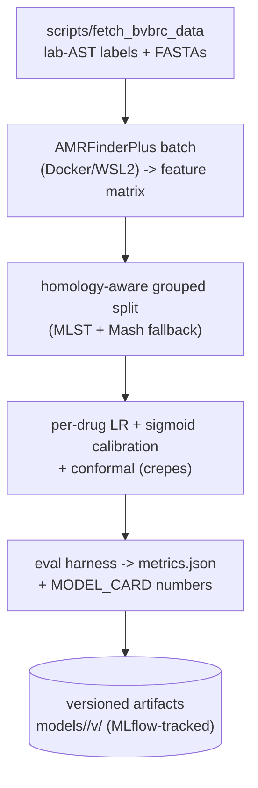

# 6. Runtime View



## Primary scenario — predict from a genome

```
1. UI/API receives a FASTA (POST /predict).
2. reader.fasta_parser validates -> GenomeInput.
3. annotation.amrfinder runs AMRFinderPlus (Docker/WSL2) -> {ok, data} envelope
   (or MockAnnotator in tests). Failure -> HTTP 503 {ok:false, error}, never a traceback.
4. features.build_features -> GenomeFeatureVector (validated against feature_schema.json;
   typed error on schema/DB-version mismatch).
5. predictor.predict, per antibiotic:
   a. target_gate: known mechanism / target-absence -> deterministic verdict (evidence=known_mechanism).
   b. else calibrated logistic regression -> probability.
   c. conformal set -> {S}=work, {R}=fail, {S,R}=no-call (ambiguous), {}=no-call (novel/OOD).
6. report.report_builder -> deterministic GenomeReport (+ mandatory disclaimer). [MVP ends here]
7. (optional) narrative sub-pipeline: kb RAG -> narrate (LLM, temp 0) -> verify grounding (LLM,
   fail-closed to template) -> attach narrative. Frozen report; LLM cannot alter a verdict.
8. Response -> UI: firewall rule table + evidence + calibration + non-dismissible disclaimer banner.
```

## Training scenario (offline)



Detail: [`research-findings/ml-methodology.md`](research-findings/ml-methodology.md), [`amrfinderplus-features.md`](research-findings/amrfinderplus-features.md).
