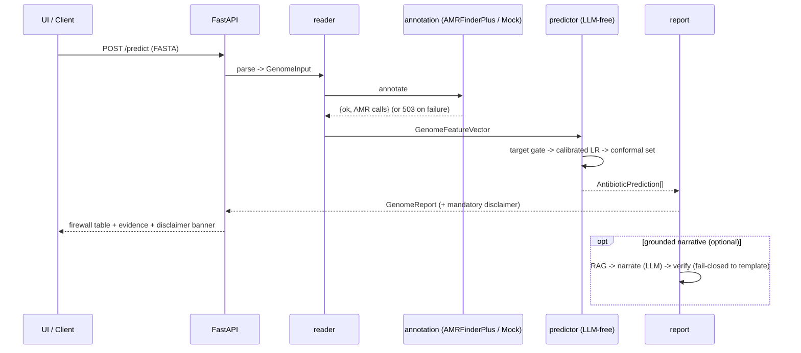
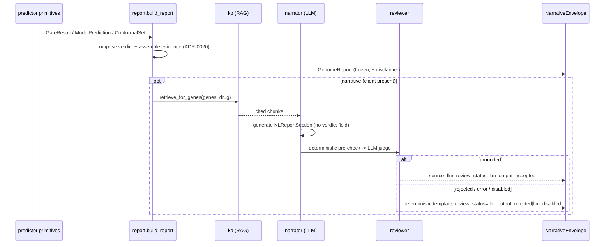
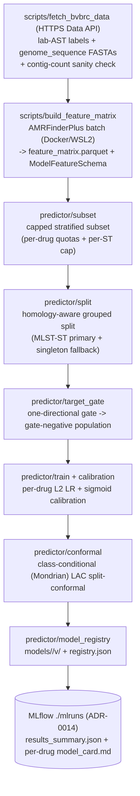

# 6. Runtime View



## Primary scenario — predict from a genome

```
1. UI/API receives a FASTA (POST /predict).
2. reader.fasta_parser validates -> GenomeInput.
3. annotation.amrfinder runs AMRFinderPlus (Docker/WSL2) -> {ok, data} envelope
   (or MockAnnotator in tests). Failure -> HTTP 503 {ok:false, error}, never a traceback.
4. features.build_features -> GenomeFeatureVector (validated against feature_schema.json;
   typed error on schema/DB-version mismatch).
5. predictor.predict, per antibiotic (registry-backed; a genome whose AMRFinderPlus DB / feature-
   schema version disagrees with the trained models raises a typed compat error before any verdict):
   a. target_gate: a called known resistance mechanism -> deterministic likely_to_fail
      (evidence=known_mechanism, conf=0.99, conformal_set=None). ONE-DIRECTIONAL (ADR-0018): the
      gate never forces likely_to_work from marker-absence.
   b. drug with no trained model (min-n insufficient / not registered) -> honest no_call / no_signal.
   c. else calibrated logistic regression -> probability; per-genome evidence = the signed LR
      coefficients of the genome's present features (statistical_association).
   d. conformal set -> {S}=work, {R}=fail, {S,R}=no-call (ambiguous), {}=no-call (novel/OOD).
6. report.report_builder -> deterministic GenomeReport (+ mandatory disclaimer). [MVP ends here]
7. (optional) narrative sub-pipeline: kb RAG -> narrate (LLM, temp 0) -> verify grounding (LLM,
   fail-closed to template) -> attach narrative. Frozen report; LLM cannot alter a verdict.
8. Response -> UI: firewall rule table + evidence + calibration + non-dismissible disclaimer banner.
```

## Decision report + narrative sub-pipeline (EPIC 4 + 5)

The deterministic builder and the additive narrative are two separable steps in Module 03a.

```
Deterministic (EPIC 4, zero-LLM — the green floor and demo fallback):
  report.build_report(GenomePredictionInputs) per drug:
    1. evaluate_gate(drug, vector)  [re-run; pure]
    2. off-panel (target_present is None) or insufficient_data -> no_call / no_signal / 0.0
    3. gate fired -> forced likely_to_fail, confidence 0.99, known_mechanism evidence (ADR-0018)
    4. else verdict = verdict_for_conformal_set(conformal_set); confidence from ModelPrediction
    5. report.evidence.assemble_evidence -> EvidenceItem[] + row category (ADR-0020:
       known_mechanism iff a curated-KB gene is cited; strongest-cited wins; else statistical/no_signal)
  -> GenomeReport (+ mandatory disclaimer; narrative_summary=None)

Additive narrative (EPIC 5, optional; receives the FROZEN report):
  report.narrate_report(report, client, retriever) -> NarrativeEnvelope
    1. client is None -> template, review_status=llm_disabled
    2. kb.EvidenceRAG.retrieve_for_genes(supporting_features, drug)  [BM25 (+optional dense) + RRF]
    3. narrator.generate_narrative (LLM, temp 0; verdicts are read-only context; output schema
       has no verdict field)
    4. reviewer.review_narrative: deterministic pre-check BEFORE the LLM judge -- rejects fabricated
       drugs/verdicts/causal claims, and numbers bound PER-DRUG (a per-antibiotic N% must equal that
       drug's own rendered confidence; free-text summary/caveats keep global membership; ADR-0023);
       then the LLM judge
    5. overall_pass -> attach flattened narrative (a fail-closed tripwire re-checks that every
       published percent is one of the report's own numbers, ADR-0023),
       review_status=llm_output_accepted, source=llm
       else -> deterministic template, review_status=llm_output_rejected, source=template
  The disclaimer is present on every branch; the LLM can never alter a verdict/confidence.
```



## EPIC 6 — the demo surface (in-process orchestrator)

`genome_firewall/service.py:analyze_genome` is the single pipeline both demo surfaces call
(ADR-0022): `parse_fasta -> annotate -> build_feature_vector -> predict_genome -> adapter ->
build_report -> narrate_report -> NarrativeEnvelope`. The **Streamlit UI calls it in-process**
(no HTTP hop, one deploy process); **FastAPI wraps the same function** as a separate, reusable
surface.

- The adapter `to_prediction_inputs` emits only predictor primitives (`ModelPrediction`,
  `ConformalSet`, top features, `insufficient_data`) into the decoupled `report.inputs` contract —
  never a verdict. `analyze_genome` still calls the sovereign `predict_genome` first (golden rule
  #1) for its fail-loud DB/schema compat guard; `build_report` re-derives the presentation rows
  with honest ADR-0020 evidence tagging, and `tests/service/test_verdict_reconciliation.py` pins
  the two frozen paths to agree row-for-row on verdict + confidence.
- Errors are typed and structured, never a traceback: a malformed upload -> `FastaParseError` ->
  **422**; a tool/infra failure (annotation `ok=False`, DB/schema mismatch) -> `PipelineError` ->
  **503 `{ok:false,error}`** (client message carries no filesystem path; the fuller detail is
  server-log only). The disclaimer is present on every branch and every UI view.
- Offline by default: `MockAnnotator` over bundled demo fixtures + no OpenAI key (deterministic
  template, `review_status=llm_disabled`). Real AMRFinderPlus is opt-in via `GF_USE_DOCKER=1`; the
  real OpenAI narrative is key-gated — both are manual-test only, never CI.

```mermaid
sequenceDiagram
    participant C as UI (in-process) / API client
    participant S as service.analyze_genome
    participant P as predictor (sovereign)
    participant B as report.build_report
    participant N as narrate_report
    C->>S: FASTA + genome_id
    S->>S: parse_fasta (StringIO) -> annotate -> build_feature_vector
    S->>P: predict_genome (compat guard + sovereign verdicts)
    S->>S: to_prediction_inputs (primitives only, no verdict)
    S->>B: build_report (ADR-0020 evidence)
    S->>N: narrate_report (client optional; fail-closed to template)
    N-->>C: NarrativeEnvelope (report + review_status + source + disclaimer)
```

## Training scenario (offline)



The real training run (scripts/train_predictor.py) is orchestrated by `predictor/train_and_register`; it is offline of BV-BRC (the matrix is prebuilt under Docker) and never runs in CI. Real 130-genome-subset results live in `models/results_summary.json` and the per-drug `model_card.md`.

Detail: [`research-findings/ml-methodology.md`](research-findings/ml-methodology.md), [`amrfinderplus-features.md`](research-findings/amrfinderplus-features.md).
