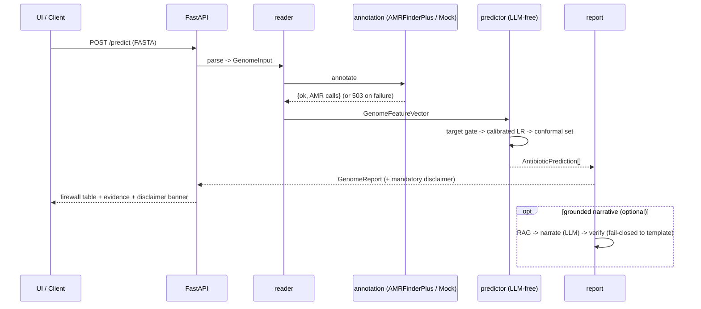
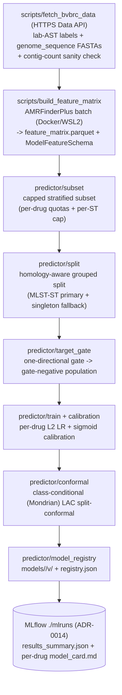

# 6. Runtime View



## Primary scenario — predict from a genome

```
1. UI/API receives a FASTA (POST /predict).
2. reader.fasta_parser validates -> GenomeInput.
3. annotation.amrfinder runs AMRFinderPlus (Docker/WSL2) -> {ok, data} envelope
   (or MockAnnotator in tests). Failure -> HTTP 503 {ok:false, error}, never a traceback.
4. features.build_features -> GenomeFeatureVector (validated against feature_schema.json;
   typed error on schema/DB-version mismatch).
5. predictor.predict, per antibiotic (registry-backed; a genome whose AMRFinderPlus DB / feature-
   schema version disagrees with the trained models raises a typed compat error before any verdict):
   a. target_gate: a called known resistance mechanism -> deterministic likely_to_fail
      (evidence=known_mechanism, conf=0.99, conformal_set=None). ONE-DIRECTIONAL (ADR-0018): the
      gate never forces likely_to_work from marker-absence.
   b. drug with no trained model (min-n insufficient / not registered) -> honest no_call / no_signal.
   c. else calibrated logistic regression -> probability; per-genome evidence = the signed LR
      coefficients of the genome's present features (statistical_association).
   d. conformal set -> {S}=work, {R}=fail, {S,R}=no-call (ambiguous), {}=no-call (novel/OOD).
6. report.report_builder -> deterministic GenomeReport (+ mandatory disclaimer). [MVP ends here]
7. (optional) narrative sub-pipeline: kb RAG -> narrate (LLM, temp 0) -> verify grounding (LLM,
   fail-closed to template) -> attach narrative. Frozen report; LLM cannot alter a verdict.
8. Response -> UI: firewall rule table + evidence + calibration + non-dismissible disclaimer banner.
```

## Training scenario (offline)



The real training run (scripts/train_predictor.py) is orchestrated by `predictor/train_and_register`; it is offline of BV-BRC (the matrix is prebuilt under Docker) and never runs in CI. Real 130-genome-subset results live in `models/results_summary.json` and the per-drug `model_card.md`.

Detail: [`research-findings/ml-methodology.md`](research-findings/ml-methodology.md), [`amrfinderplus-features.md`](research-findings/amrfinderplus-features.md).
