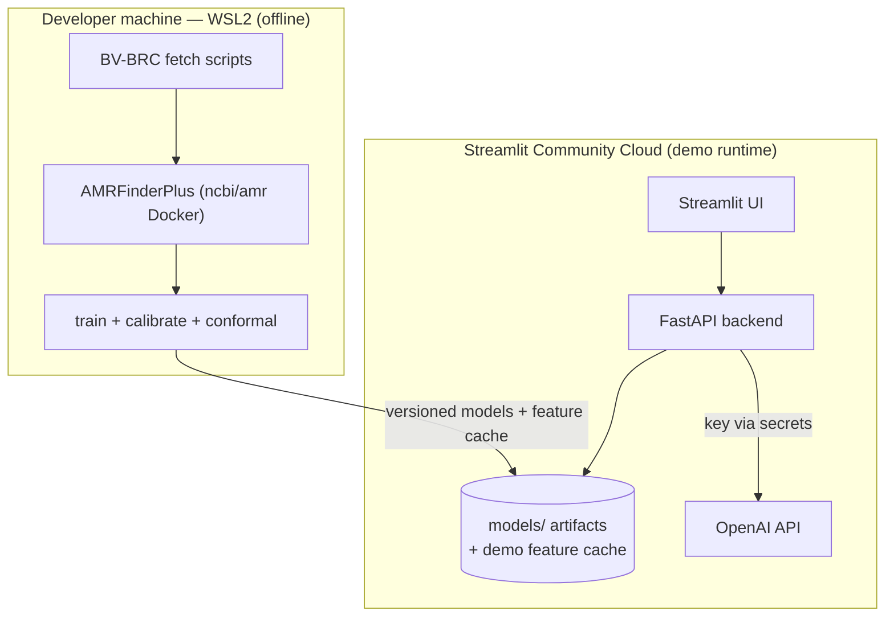

# 7. Deployment View

- **Demo runtime:** pure-Python (Streamlit + FastAPI) on Streamlit Community Cloud; OpenAI key via secrets. **No Docker at demo time** — trained models and a feature cache for the demo genomes ship with the app; the deterministic no-LLM path is the rehearsed fallback.
- **Offline (dev, WSL2):** AMRFinderPlus runs via the pinned `ncbi/amr` Docker image to build the feature matrix and train per-antibiotic models; artifacts are versioned into `models/<drug>/v<N>/`.
- **CI:** no bio-tools, no Docker — `MockAnnotator` + committed fixture TSVs drive the full pipeline. See [ADR-0002](../09-architecture-decisions/ADR-0002-amrfinderplus-via-docker-wsl2.md), [ADR-0007](../09-architecture-decisions/ADR-0007-streamlit-fastapi-demo-stack.md).
