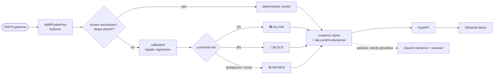

# Genome Firewall

> **Turn a bacterial genome into an earlier, honest antibiotic-response prediction — before the lab result arrives.**
> Hack-Nation 6th Global AI Hackathon · Challenge 06 · strictly defensive decision support.

Genome Firewall reads a reconstructed, quality-checked **_Klebsiella pneumoniae_** genome (FASTA) and, for each antibiotic in its panel, returns one of three firewall rules:

- 🟢 **ALLOW** — likely to work
- 🔴 **BLOCK** — likely to fail (resistant)
- 🟡 **REVIEW** — no-call (evidence weak, conflicting, or unlike anything seen in training)

Each verdict carries a **calibrated confidence score** and the **supporting genes/mutations**, and clearly separates a *known resistance mechanism* from a mere *statistical association*. Every result insists on confirmation by standard laboratory testing.

> ⚠️ **Research prototype — not a medical device.** See [`DISCLAIMER`](DISCLAIMER). It analyzes genomes; it never designs, modifies, or optimizes an organism.

## Why

Antibiotic-resistant infections kill more than one million people a year directly. Standard susceptibility testing takes 1–3 days; during that window clinicians must guess. Much of the answer is already written in the pathogen's DNA — Genome Firewall surfaces it earlier, *honestly*, with calibrated confidence and an explicit no-call.

## How it works



- **Module 01 — Genome Reader:** AMRFinderPlus (NCBI, pinned Docker) turns the genome into a gene/mutation feature matrix.
- **Module 02 — Predictor** *(the star, classical ML done rigorously)*: per-antibiotic L2 logistic regression, sigmoid calibration, and **conformal prediction** for a principled no-call, on a **homology-aware grouped split** so near-identical genomes never leak across train/test. A deterministic molecular-target/known-mechanism gate precedes the model.
- **Module 03 — Decision Report:** a Streamlit + FastAPI app rendering the firewall rule table, per-drug evidence, calibration/reliability plots, and a mandatory lab-confirmation banner.

**The LLM never predicts.** OpenAI is used only for evidence RAG, grounded report narration, and an LLM-as-reviewer that fails closed — its output schemas contain no verdict field.

## Quickstart

Requires Python 3.11+ and [uv](https://docs.astral.sh/uv/getting-started/installation/) (the project's package/venv manager — install it once per machine, before `uv sync`):

```bash
# macOS / Linux
curl -LsSf https://astral.sh/uv/install.sh | sh
# Windows (PowerShell)
powershell -ExecutionPolicy ByPass -c "irm https://astral.sh/uv/install.ps1 | iex"
```

The official installer registers `uv` on PATH itself; open a new terminal afterward. (If you instead installed via a package manager like WinGet/Homebrew and `uv` isn't found, check that its install directory landed on PATH — package-manager shims don't always link it.)

```bash
uv sync --all-extras
uv run pytest                                          # quality gate (coverage >= 80)
uv run uvicorn genome_firewall.api.main:app --reload   # backend
uv run streamlit run src/genome_firewall/ui/app.py     # demo
```

Heavy annotation (AMRFinderPlus) runs via Docker under WSL2 — see [`Documentation/research-findings/amrfinderplus-features.md`](Documentation/research-findings/amrfinderplus-features.md). Tests never need it (they use a mock + fixtures).

## Repository layout

| Path | What |
|---|---|
| [`Documentation/01-introduction-and-goals/prd.md`](Documentation/01-introduction-and-goals/prd.md) | Product requirements / implementation plan |
| [`Documentation/`](Documentation/) | arc42 docs, ADRs, model card, datasheet, **research-findings** |
| `src/genome_firewall/` | The package (reader, predictor, report, llm, kb, api, ui, eval) |
| `scripts/` | BV-BRC data acquisition, AMRFinderPlus batch, dataset build |
| `tests/` | Unit + integration (mocked annotator) |
| `ground-truth/` | Append-only decision log (case-study data for the SE paper) |

## Responsible AI

Genome Firewall is built to the challenge's responsibility requirements: defensive by construction, honest generalization (performance reported on unseen genetic groups; see [`Documentation/MODEL_CARD.md`](Documentation/MODEL_CARD.md)), calibrated confidence with a first-class no-call, honest evidence (known-mechanism vs statistical association), and mandatory human oversight.

## License & authors

[Apache-2.0](LICENSE). Built by **Sebastian Wienhold** with Claude (Fable 5) as an intentional case study of a six-layer *Sustainable Agentic Software Engineering* workflow.
